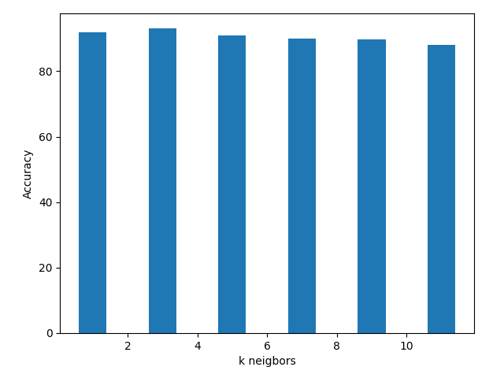
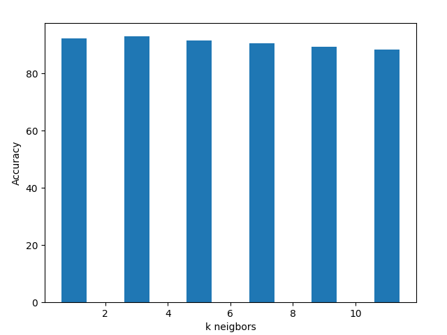
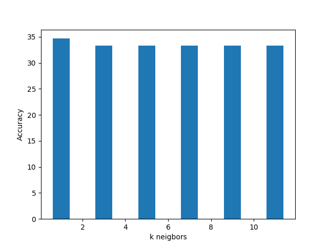
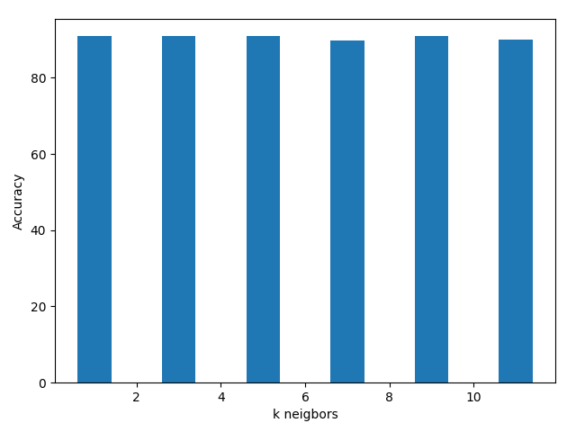

# Classification of Images with KNN Algorithm

## Classification with KNN 

#### Extracting Features from Images

In order to classify the images in the most faultless manner, different methods and filters must be applied to the images.
In this case, images resized to **100x100 pixels** to expedite the process; **Canny edge detection and Gabor filter** are used to extract the features of images.
Via Canny, edge structure of the images are detected with low error rate.
Gabor filter is used to extract the texture information of the images.

#### Selecting Optimum k Value For k-Nearest-Neighbor Algorithm

Determination of k value is the crucial point of KNN algorithm in order to classify the data properly. 
Large values of k smooth out the regional oddness of the data while small values of k may cause overfitting.
Therefore, value of k must be chosen carefully by taking the empirical results into consideration.

* To minimize the overfitting, cross validation method with 5 folds as optimum was used in the process of classification with training data.  
* In the test case, dataset consist of %80 training data and %20 test data.
* In the first step, training data has been tested with 6 different k values: **1, 3, 5, 7, 9, 11** (*to avoid classification errors, all values selected among odd numbers*).

Training data with **300 images** has been tested.  
Mean accuracy is **%90.61**.  
Maximum accuracy is **%93.0**  
k value which gives maximum accuracy: **3**.

Test data with **300 images** has been tested.  
Mean accuracy is **%68.05**.  
Maximum accuracy is **%81.67**  
k value which gives maximum accuracy: **1**.

## Classification with Weighted KNN 

In weighted KNN algorithm, **inverse distance weighting** method has been used to determine the importance of the points in terms of distance. According to this method, the nearest neighbors' labels have more powerful effect on classification than that of farther neighbors.

Training data with **300 images** has been tested.  
Mean accuracy is **%90.89**.  
Maximum accuracy is **%93.0**  
k value which gives maximum accuracy: **3**.

Test data with **300 images** has been tested.  
Mean accuracy is **%71.94**. 
Maximum accuracy is **%81.67**  
k value which gives maximum accuracy: **1**.

#### Importance of the Quantity of Traning Data

It is generally a good practice to use as many data as possible in addition to the quality of the data to avoid overfitting or underfitting problems in training phase. In this assignment, different sizes of training data has been used in order to understand the effects of the quantity of the data on accuracy.

Algorithm has been applied on variety of differently sized test datasets: *50, 100, 300, 600*.

Changes in error percentages per test dataset as below (change in the error values has been stated seperately for each k value with different color):

**Overall error value has decreased as the dataset size gets large.**

For weighted KNN algorithm:

**Overall error value has decreased as the dataset size gets large.**

## Comparison Between KNN and Weighted KNN

As it can be seen above, weighted KNN algorithm has not had powerful impact overall error value for k = 1.

However, for k = 11, the fall in the error becomes visible.

With 1-KNN, points are coherently classified according to the nearest neighbor. However, as the k increases, number of neighbors that is taken into consideration enlarges the circle of neighborhood. Therefore, inside of these neighbors, the closest ones become important since **inverse distance weighting** method is used to determine the importance of these neighbors.
**As a result, k values that generate large neighborhoods are the ones that are effected the most by weighted KNN algorithm in terms of accuracy.**

## Error Analysis

* Resizing images to a smaller size results in more error due to the loss of detail/information of the image. The lesser the number of pixels,the lesser accuracy from filters.
* Size of dataset that is used in training: Large numbers of images increase the accuracy, on the other hand, running time gets larger and larger; use of relatively small datasets throughout the analysis may caused increase in error.
* Selection of k value: In general, error value has decreased with the increase in the k value. However, the optimum k value for these datasets is **3** with the least error which is **%93.0** for KNN.
* Selection of filters. Canny edge detection filter by itself has given error up to **%66**. Therefore, it was not a good choice to use it to classify the images with high accuracy.

Canny edge detection accuracy values on **300** images with mean accuracy value **33.42** using **KNN**.

However, Gabor filter has given more accuracy with mean accuracy value **%90.61** using **KNN**.

Gabor filter accuracy values on **300** images with **KNN**.

* Despite the fact that Gabor filter was more accurate, it was time consuming filter which constituted the major part of the running time.
